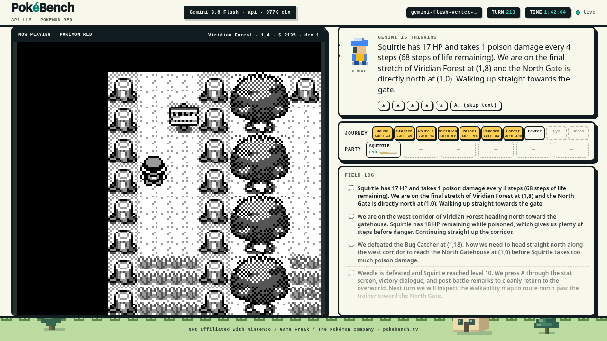
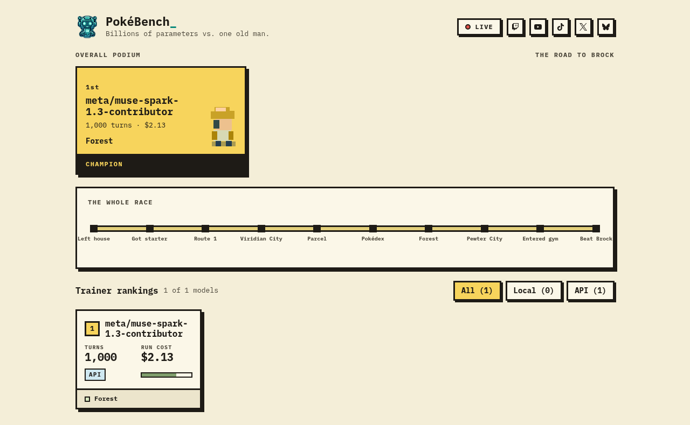

# PokéBench

A local 27B model plays Pokémon Red on stream. Frontier models get the same seat, the same prompt, and the
same 1,000-turn budget. Furthest milestone wins, fewer turns breaks ties, and Brock is the ceiling.

**[Watch live on Twitch](https://twitch.tv/pokebenchtv)** · **[VODs on YouTube](https://youtube.com/@pokebenchtv)** · **[Leaderboard at pokebench.tv](https://pokebench.tv)**



The interesting question isn't whether a model can beat Pokémon with a big harness. It's how far a free
model on one GPU gets against a run that costs real money, when both get one screenshot, one ASCII
walkability map, the words on screen, and six button presses a turn.

Nobody judges anything. All ten milestones, from walking out the front door to the Boulder Badge, are read
straight out of the game's memory, and where a model stalls out is its score.

[](https://pokebench.tv)

Rules: [BENCHMARK-SPEC.md](BENCHMARK-SPEC.md). Candidate models: [docs/model-corpus.md](docs/model-corpus.md).

Not affiliated with Nintendo, Game Freak, or The Pokémon Company. Bring your own ROM. This repo does not
contain or download one, and `roms/` is gitignored.

## Run this yourself

You need Python 3.12, a Pokémon Red ROM you own (`Pokemon Red.gb`), and [Ollama](https://ollama.com) with a
vision-capable model pulled. The reference model is `qwen3.8:27b` at Q4, which uses about 20.5 GB of VRAM at
the 64K context the harness asks for. Smaller models work; the leaderboard only takes vision-capable ones.

1. Clone and install:

   ```bash
   git clone https://github.com/VibeCodyH/pokebench
   cd pokebench
   python3.12 -m venv .venv && . .venv/bin/activate
   pip install -r requirements.txt
   ```

2. Put your ROM at `roms/Pokemon Red.gb`.

3. Start the game server. It boots the emulator, keeps it running in real time between turns, and serves the
   dashboard:

   ```bash
   python serve_live.py --rom "roms/Pokemon Red.gb" --port 8765
   ```

4. In a second terminal, start a run. `OLLAMA_HOST` defaults to `http://localhost:11434`; point it at
   whichever host serves your models:

   ```bash
   OLLAMA_HOST=http://localhost:11434 python qwen_red.py --model qwen3.8:27b --run-name "my first run"
   ```

   Useful flags: `--turns 200` for a short test, `--think low|medium|high` (the benchmark runs `high`),
   `--no-frames` to skip saving a PNG per turn.

5. Watch at <http://localhost:8765/stream>. That page is what the recorder captures; it's a fixed 1280x720
   canvas scaled to the window. The upstream `/dashboard` still works for START / PAUSE / STOP.

Each run writes its own directory under `runs/`, holding `summary.json` (the score: milestones with the turn
each was hit, tokens, wall time, prompt and harness SHAs) and `log.jsonl` (every turn: the exact prompt she
saw, her thinking, her plan, what each button did, the words on screen). Every field is spelled out in
[docs/log-format.md](docs/log-format.md). `python site/build_runs.py` folds every `summary.json` into
`site/runs.json` for the leaderboard.

### Docker instead

```bash
docker build -f docker/Dockerfile -t pokebench-server .
docker run -d --name pokebench-server --network host \
  -v "$PWD/roms:/app/roms" -v "$PWD/runs:/app/runs" pokebench-server
docker exec -d pokebench-server sh -c 'python qwen_red.py --run-name "docker run" > /app/runs/harness.log 2>&1'
```

`--network host` is so the container reaches Ollama on `localhost:11434`. The harness code is baked into the
image; rebuild after pulling.

### Recording and streaming

`recorder/` is a separate container: headless Chromium on the `/stream` page into FFmpeg with NVENC, writing
an MP4 and optionally pushing the same encode to one or two RTMP targets. Setup and env vars are in
[recorder/README.md](recorder/README.md). Leave `RTMP_URL` empty to record only.

### Frontier models

`run_benchmark.py --model-key <key>` runs the same loop through `providers.py` against an entry in
`models.yaml`. The Ollama, OpenRouter and Google adapters have each driven a complete run; Bedrock reads
real frames correctly but hasn't finished one yet. The Anthropic row needs verified rates before it can
post a score, and `openai-template` is a row shape to copy, not a runnable model.

## What's in here

| File | Job |
|---|---|
| `serve_live.py` | Wraps [NousResearch/pokemon-agent](https://github.com/NousResearch/pokemon-agent)'s server: real-time ticker, correct enemy species in wild battles, `a_until_dialog_end` that reads the text box from RAM and returns what it skipped, `/frame`, `/action/traced`, `/milestones`, and the `/stream` page |
| `qwen_red.py` | The turn loop and the system prompt. `PROMPT_VERSION` changes whenever the prompt does; every run records it |
| `run_benchmark.py` | The same loop, driven from the registry instead of a CLI flag. This is the path every non-Ollama run takes |
| `providers.py` | One adapter per API. Each turns `(system, user, image, schema)` into a plan, so the loop never learns a provider's quirks |
| `models.yaml` | The registry: every model's id, context, think level, and price. Unverified rates stay `null` on purpose, because an honest unknown beats a made-up number |
| `milestones.py` | The 10-rung ladder, detected from RAM. No human judging |
| `stream.html` | The dashboard the recorder captures |
| `site/` | The leaderboard, static, data-driven from `runs.json` |
| `BENCHMARK-SPEC.md` | The rules. Read this before arguing about a score |

## Honesty rules

Results on the site come from `summary.json` files the harness wrote, with the prompt SHA and harness SHA
attached. Sample data on the site is labeled as sample data. Model behavior we think is funny (naming
herself AAAAA, arguing with a sign) is left alone; the harness fixes things that misled her, never things she
got wrong on her own. The line between the two is argued in `docs/reviews/`.

MIT licensed. The ROM isn't ours and isn't included.
